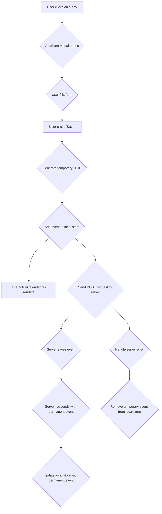
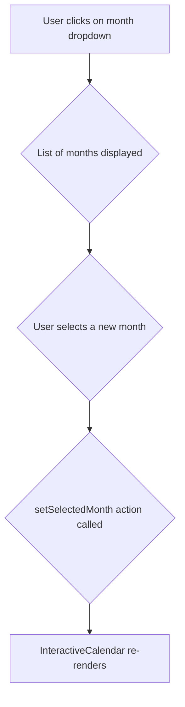
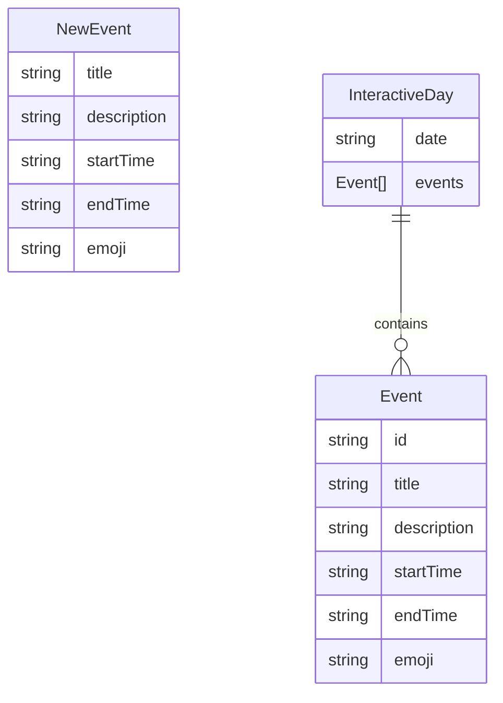

# React + TypeScript + Vite

This template provides a minimal setup to get React working in Vite with HMR and some ESLint rules.

Currently, two official plugins are available:

- [@vitejs/plugin-react](https://github.com/vitejs/vite-plugin-react/blob/main/packages/plugin-react/README.md) uses [Babel](https://babeljs.io/) for Fast Refresh
- [@vitejs/plugin-react-swc](https://github.com/vitejs/vite-plugin-react-swc) uses [SWC](httpss://swc.rs/) for Fast Refresh

## Expanding the ESLint configuration

If you are developing a production application, we recommend updating the configuration to enable type aware lint rules:

- Configure the top-level `parserOptions` property like this:

```js
export default tseslint.config({
  languageOptions: {
    // other options...
    parserOptions: {
      project: ['./tsconfig.node.json', './tsconfig.app.json'],
      tsconfigRootDir: import.meta.dirname,
    },
  },
})
```

- Replace `tseslint.configs.recommended` to `tseslint.configs.recommendedTypeChecked` or `tseslint.configs.strictTypeChecked`
- Optionally add `...tseslint.configs.stylisticTypeChecked`
- Install [eslint-plugin-react](https://github.com/jsx-eslint/eslint-plugin-react) and update the config:

```js
// eslint.config.js
import react from 'eslint-plugin-react'

export default tseslint.config({
  // Set the react version
  settings: { react: { version: '18.3' } },
  plugins: {
    // Add the react plugin
    react,
  },
  rules: {
    // other rules...
    // Enable its recommended rules
    ...react.configs.recommended.rules,
    ...react.configs['jsx-runtime'].rules,
  },
})
```

## Features

### Event Management

#### Purpose

Allows users to add, view, and delete events on the calendar.

#### Components

- `CalendarScreen.tsx`: The main screen that orchestrates the feature.
- `InteractiveCalendar.tsx`: The component that displays the calendar grid and the events.
- `AddEventModal.tsx`: The modal form for adding new events.

#### State Management

- `calendarStore.tsx`: The Zustand store that manages the events data. It now includes a `createEvent` function that handles the optimistic UI flow.

#### User Interaction Flow

1.  User clicks on a day in the `InteractiveCalendar`.
2.  The `AddEventModal` opens.
3.  User fills in the event details and clicks "Save".
4.  A temporary UUID is generated for the new event, and it is immediately added to the local `calendarStore`.
5.  The `InteractiveCalendar` re-renders to display the new event (optimistic UI).
6.  In the background, a `POST` request is sent to the server to save the event to the database.
7.  Once the server responds with the permanent event data (including the database-generated `id`), the local `calendarStore` is updated with the permanent data.
8.  If the server request fails, the temporary event is removed from the `calendarStore` and an error is displayed.

#### Flow Diagram



### Calendar Navigation

#### Purpose

Allows users to navigate between different months in the calendar.

#### Components

- `CalendarScreen.tsx`: The main screen that orchestrates the feature.
- `Dropdown.tsx`: The component that displays the month selection dropdown.

#### State Management

- `calendarStore.tsx`: The Zustand store that manages the selected month.

#### User Interaction Flow

1.  User clicks on the month selection dropdown.
2.  A list of months is displayed.
3.  User selects a new month.
4.  The `setSelectedMonth` action is called in the `calendarStore`.
5.  The `InteractiveCalendar` re-renders to display the events for the selected month.

#### Flow Diagram



## Supporting Modules

### Data Models



- `Event`: Represents an event on the calendar.
- `NewEvent`: Represents a new event that has not yet been saved to the database.
- `InteractiveDay`: Represents a day in the calendar, containing a date and a list of events.
- `DropdownOption`: Represents an option in a dropdown menu.
- `FormErrors`: Represents the errors in a form.
- `TextAndIcon`: Represents a text and an icon.
- `TMonths`: Represents the months of the year.

### Services

- `eventService.ts`: A service that handles all API calls related to events.

### Helpers and Utilities

- `cn`: A utility function for conditionally joining class names.
- `getDaysInMonth`: Returns an array of dates for a given month and year.
- `checkForValidDate`: Checks if a given date string is a valid date.
- `immutableStateUpdateFactory`: A factory function that returns a function that updates the state of a component in an immutable way.
- `getCleanCalendarDays`: Returns an array of `InteractiveDay` objects for a given month.
- `customResolver`: A custom resolver for `react-hook-form` that validates that all fields are filled.
- `monthsDropdownOptions`: An array of `DropdownOption` objects for the months of the year.
- `emojisDropdownOptions`: An array of `DropdownOption` objects for the available emojis.
- `currentMonth`: The current month as a string.

### Enums

- `APP_ROUTES`: An object containing the routes of the application.
- `MONTHS`: An object containing the months of the year.

### Higher-Order Components (HOCs)

- `withDropdownController`: A HOC that connects a `Dropdown` component to a `react-hook-form` controller.
