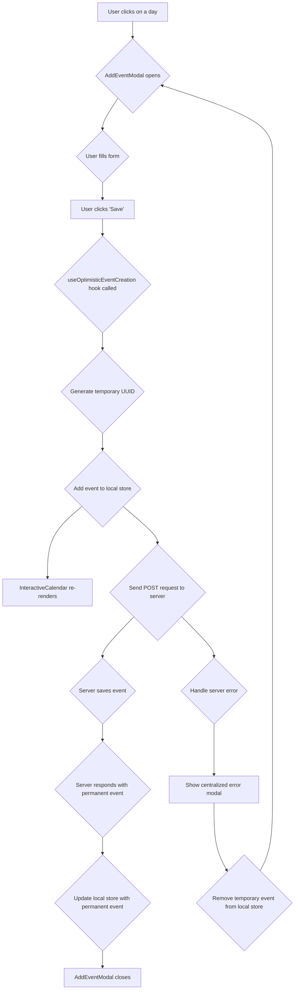
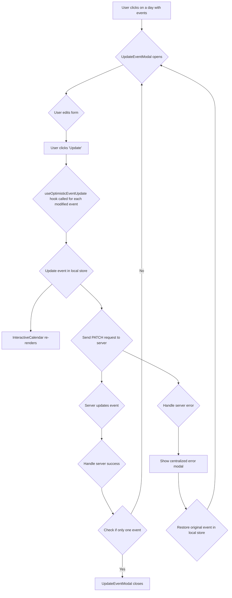
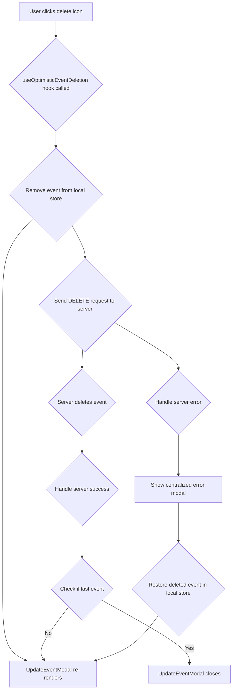
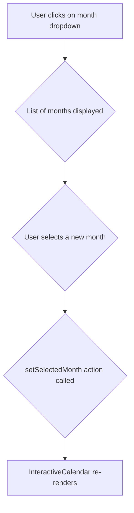
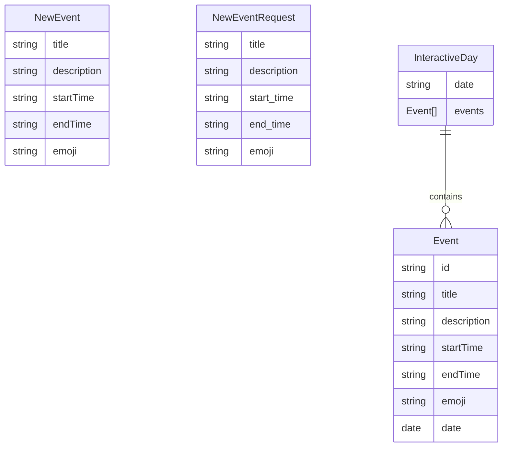

# React + TypeScript + Vite

This template provides a minimal setup to get React working in Vite with HMR and some ESLint rules.

Currently, two official plugins are available:

- [@vitejs/plugin-react](https://github.com/vitejs/vite-plugin-react/blob/main/packages/plugin-react/README.md) uses [Babel](https://babeljs.io/) for Fast Refresh
- [@vitejs/plugin-react-swc](https://github.com/vitejs/vite-plugin-react-swc) uses [SWC](https://swc.rs/) for Fast Refresh

## Expanding the ESLint configuration

If you are developing a production application, we recommend updating the configuration to enable type aware lint rules:

- Configure the top-level `parserOptions` property like this:

```js
export default tseslint.config({
  languageOptions: {
    // other options...
    parserOptions: {
      project: ['./tsconfig.node.json', './tsconfig.app.json'],
      tsconfigRootDir: import.meta.dirname,
    },
  },
})
```

- Replace `tseslint.configs.recommended` to `tseslint.configs.recommendedTypeChecked` or `tseslint.configs.strictTypeChecked`
- Optionally add `...tseslint.configs.stylisticTypeChecked`
- Install [eslint-plugin-react](https://github.com/jsx-eslint/eslint-plugin-react) and update the config:

```js
// eslint.config.js
import react from 'eslint-plugin-react'

export default tseslint.config({
  // Set the react version
  settings: { react: { version: '18.3' } },
  plugins: {
    // Add the react plugin
    react,
  },
  rules: {
    // other rules...
    // Enable its recommended rules
    ...react.configs.recommended.rules,
    ...react.configs['jsx-runtime'].rules,
  },
})
```

## Features

### Error Handling

The application uses a centralized error modal to display errors to the user.

#### Components

- `ErrorModal.tsx`: A reusable modal component for displaying error messages.
- `errorStore.tsx`: A Zustand store that manages the state of the error modal (e.g., whether it's open, the title, and the description).

#### Custom Hooks

- `useErrorStore.ts`: A hook that provides access to the error store and the `showError` and `hideError` functions.

#### Usage

To display an error, import the `useErrorStore` hook and call the `showError` function:

`
import { useErrorStore } from '@/store/errorStore';

const { showError } = useErrorStore();

// To display an error:
showError('Error Title', 'An unexpected error occurred.');
`

This system is used in the optimistic update hooks (`useOptimisticEventCreation.ts`, `useOptimisticEventUpdate.ts`, `useOptimisticEventDeletion.ts`) to display errors that occur during API calls.

### Form Handling

The forms in this application follow a standardized approach using the following libraries:

- **`react-hook-form`**: For managing form state and validation.
- **`zod`**: For defining validation schemas.
- **`@hookform/resolvers/zod`**: To use Zod schemas with `react-hook-form`.

The implementation strategy is as follows:

1.  **Zod Schema**: A Zod schema is defined for each form to specify the validation rules.
2.  **Type Inference**: The form's data type is inferred from the Zod schema using `z.infer`.
3.  **`withController` HOC**: A single, generic Higher-Order Component, `withController`, is used to wrap all form input components. This HOC connects the input to the `react-hook-form` state, and it also handles the display of the label and validation errors.

### Event Management

#### Event Creation

##### Purpose

Allows users to add new events to the calendar.

##### Components

- `CalendarScreen.tsx`: The main screen that orchestrates the feature.
- `InteractiveCalendar.tsx`: The component that displays the calendar grid and the events.
- `AddEventModal.tsx`: The modal form for adding new events.

##### State Management

- `calendarStore.tsx`: The Zustand store that manages the events data. It now includes a `createEvent` function that handles the optimistic UI flow.

##### Custom Hooks

- `useOptimisticEventCreation.ts`: A custom hook that encapsulates the logic for optimistic event creation.

##### User Interaction Flow

1.  User clicks on a day in the `InteractiveCalendar`.
2.  The `AddEventModal` opens.
3.  User fills in the event details and clicks "Save".
4.  The `useOptimisticEventCreation` hook is called.
5.  A temporary UUID is generated for the new event, and it is immediately added to the local `calendarStore`.
6.  The `InteractiveCalendar` re-renders to display the new event (optimistic UI).
7.  In the background, a `POST` request is sent to the server to save the event to the database.
8.  Once the server responds with the permanent event data (including the database-generated `id`), the local `calendarStore` is updated with the permanent data, and the `AddEventModal` closes.
9.  If the server request fails, the temporary event is removed from the `calendarStore`, an error is displayed, and the `AddEventModal` remains open.

##### Flow Diagram



#### Event Update

##### Purpose

Allows users to edit existing events on the calendar.

##### Components

- `InteractiveCalendar.tsx`: The component that displays the calendar grid and the events.
- `UpdateEventModal.tsx`: The modal form for editing existing events.

##### Custom Hooks

- `useOptimisticEventUpdate.ts`: A custom hook that encapsulates the logic for optimistic event updates.

##### User Interaction Flow

1.  User clicks on a day with existing events in the `InteractiveCalendar`.
2.  The `UpdateEventModal` opens, displaying the details of the events for that day.
3.  User edits the event details and clicks "Update".
4.  The `useOptimisticEventUpdate` hook is called for each modified event.
5.  The local `calendarStore` is immediately updated with the new event data (optimistic UI).
6.  The `InteractiveCalendar` re-renders to display the updated event information.
7.  In the background, a `PATCH` request is sent to the server to save the changes to the database.
8.  If the server request succeeds and there was only one event being updated, the `UpdateEventModal` closes. Otherwise, it remains open.
9.  If the server request fails, the original event data is restored in the `calendarStore`, and the `UpdateEventModal` remains open.

##### Flow Diagram



#### Event Deletion

##### Purpose

Allows users to delete existing events from the calendar.

##### Components

- `UpdateEventModal.tsx`: The modal form where the delete option is present.

##### Custom Hooks

- `useOptimisticEventDeletion.ts`: A custom hook that encapsulates the logic for optimistic event deletion.

##### User Interaction Flow

1.  User clicks on the delete icon next to an event in the `UpdateEventModal`.
2.  The `useOptimisticEventDeletion` hook is called.
3.  The event is immediately removed from the local `calendarStore` (optimistic UI).
4.  The `UpdateEventModal` re-renders to remove the deleted event from the list.
5.  In the background, a `DELETE` request is sent to the server to delete the event from the database.
6.  If the server request succeeds and it was the last event for that day, the `UpdateEventModal` closes. Otherwise, it remains open.
7.  If the server request fails, the deleted event is restored in the `calendarStore`, and the `UpdateEventModal` remains open.

##### Flow Diagram



### Calendar Navigation

#### Purpose

Allows users to navigate between different months in the calendar.

#### Components

- `CalendarScreen.tsx`: The main screen that orchestrates the feature.
- `Dropdown.tsx`: The component that displays the month selection dropdown.

#### State Management

- `calendarStore.tsx`: The Zustand store that manages the selected month.

#### User Interaction Flow

1.  User clicks on the month selection dropdown.
2.  A list of months is displayed.
3.  User selects a new month.
4.  The `setSelectedMonth` action is called in the `calendarStore`.
5.  The `InteractiveCalendar` re-renders to display the events for the selected month.

#### Flow Diagram



## Supporting Modules

### Data Models



- `Event`: Represents an event on the calendar.
- `NewEvent`: Represents a new event that has not yet been saved to the database.
- `NewEventRequest`: Represents the payload for creating a new event, with snake_case properties.
- `InteractiveDay`: Represents a day in the calendar, containing a date and a list of events.
- `DropdownOption`: Represents an option in a dropdown menu.
- `FormErrors`: Represents the errors in a form.
- `TextAndIcon`: Represents a text and an icon.
- `TMonths`: Represents the months of the year.

### Services

- `eventService.ts`: A service that handles all API calls related to events.
- `utils.ts`: A utility file containing helper functions for services, such as `camelToSnakeCase`.

### Helpers and Utilities

- `cn`: A utility function for conditionally joining class names.
- `getDaysInMonth`: Returns an array of dates for a given month and year.
- `checkForValidDate`: Checks if a given date string is a valid date.
- `immutableStateUpdateFactory`: A factory function that returns a function that updates the state of a component in an immutable way.
- `getCleanCalendarDays`: Returns an array of `InteractiveDay` objects for a given month.
- `monthsDropdownOptions`: An array of `DropdownOption` objects for the months of the year.
- `emojisDropdownOptions`: An array of `DropdownOption` objects for the available emojis.
- `currentMonth`: The current month as a string.

### Enums

- `APP_ROUTES`: An object containing the routes of the application.
- `MONTHS`: An object containing the months of the year.

### Higher-Order Components (HOCs)

- `withController`: A generic HOC that connects any form input component to `react-hook-form`. It uses the `Controller` component from `react-hook-form` to handle the connection, and it also displays a label and validation errors.
